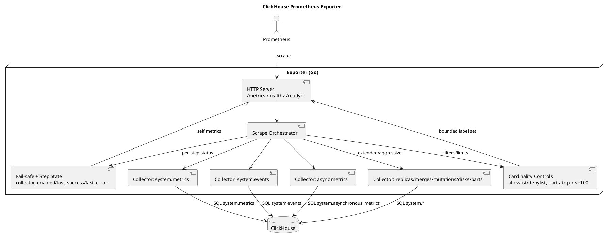

# Архитектура экспортёра

## Схема (PlantUML)

## Компоненты

- **HTTP-сервер:** `/metrics` (Prometheus), `/healthz` (liveness), `/readyz` (readiness после успешного ping CH).
- **Пул подключений:** один `clickhouse.Conn` на процесс; лимит открытых соединений из конфига.
- **Оркестратор сбора:** на каждый scrape запускаются включённые коллекторы с общим контекстом и таймаутом; ошибки коллектора учитываются, остальные продолжают работу.
- **Расширяемость через контракт шага:** `CollectorStep` + `Registry` шагов; pipeline собирается декларативно по профилю (`safe/extended/aggressive`) без правок цикла `Collect`.
- **Per-step timeout:** каждый шаг коллектора ограничен `query_timeout`, чтобы один тяжёлый запрос не съедал весь `collect_timeout`.
- **Fail-safe по версиям CH:** если шаг падает из-за отсутствующей `system.*` таблицы/колонки (`Unknown table`, `Unknown identifier` и т.п.), шаг автоматически отключается до рестарта процесса и перестаёт зашумлять логи/ошибки scrape.
- **Коллекторы (по профилю):**
  - `safe`: `system.metrics`, `system.events`, `system.asynchronous_metrics`
  - `extended`: + реплики, merges/mutations (агрегаты), диски, сводка `system.parts`, demo-шаг `system.one`
  - `aggressive`: + top-N таблиц по числу кусков (`system.parts`), лимит N из конфига

## Конфигурация

- Файл YAML и/или переменные окружения `CH_EXPORTER_*`.
- Поля: адрес CH, пользователь, пароль, TLS, `profile`, таймауты, `parts_top_n` для aggressive.
- Cardinality controls:
  - allowlist/denylist для `system.metrics`, `system.events`, `system.asynchronous_metrics`;
  - allowlist/denylist баз данных для `parts_top`;
  - hard limit `parts_top_n <= 100`.

## Имена метрик

- Префикс `ch_exporter_` для пространства имён проекта.
- Лейблы: только стабильные идентификаторы (имена метрик CH, диски, при aggressive — ограниченный набор database/table).
- Метрики состояния шагов:
  - `ch_exporter_collector_enabled{step}`
  - `ch_exporter_collector_last_success_unix{step}`
  - `ch_exporter_collector_last_error_unix{step}`
